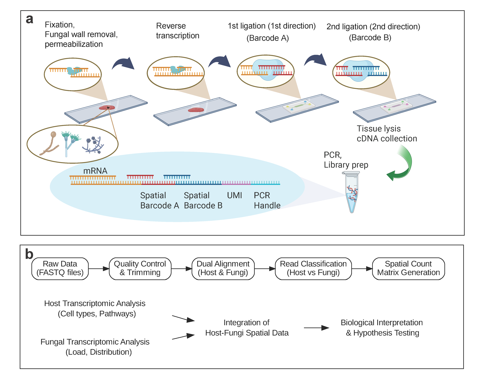

# fungal-DBiT: Spatial Mycobiome Sequencing

**fungal-DBiT** is a microfluidic-based spatial transcriptomics platform that enables simultaneous, high-resolution profiling of **host and fungal RNAs** within the same tissue section.

Unlike conventional spatial transcriptomics methods that focus exclusively on host polyadenylated transcripts, fungal-DBiT is optimized to capture **fungal transcripts**. The platform integrates:
- Optimized microfluidic spatial barcoding
- Tissue processing protocols compatible with fungal cell walls
- Sensitive detection of low-abundance fungal signals in host tissues

This technology enables spatially resolved analysis of **host–fungal interactions** in complex tissue environments.

---

## 🔬 Key Features

- Spatial mapping of both host and fungal gene expression  
- Detection of fungal RNAs 
- Compatible with low-biomass and heterogeneous fungal populations  
- Applicable to complex tissues, including gut and other mucosal organs  

---

## 📁 Repository Contents

- `python/` — Scripts and notebooks used in the fungal-DBiT data analysis pipeline  
- `images/` — Figures and diagrams used in publications or presentations  

---

## 📬 Contact

For questions or collaborations, please contact  
**Yang Liu, Ph.D.**  
Assistant Professor, Yale School of Medicine
