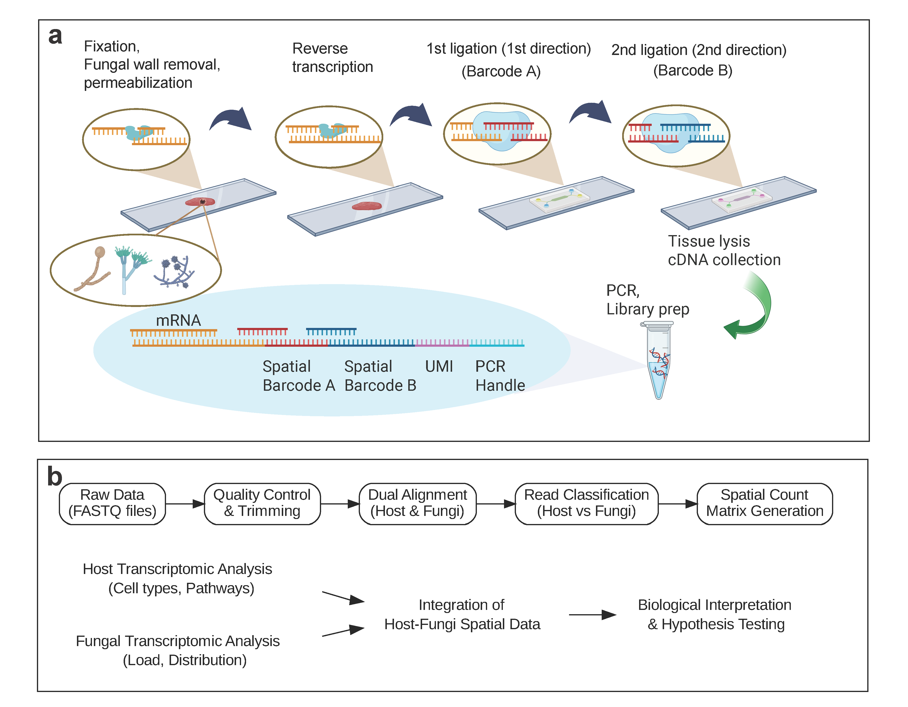

# fungal-DBiT: Spatial Mycobiome Sequencing



**fungal-DBiT** is a microfluidic-based spatial transcriptomics platform that enables simultaneous, high-resolution profiling of **host and fungal RNAs** within the same tissue section.

Unlike conventional spatial transcriptomics methods that focus exclusively on host polyadenylated transcripts, fungal-DBiT is optimized to capture **fungal transcripts**. The platform integrates:
- Optimized microfluidic spatial barcoding
- Tissue processing protocols compatible with fungal cell walls
- Sensitive detection of low-abundance fungal signals in host tissues

This technology enables spatially resolved analysis of **host–fungal interactions** in complex tissue environments.

---

## Key Features

- Spatial mapping of both host and fungal gene expression
- Detection of fungal RNAs
- Compatible with low-biomass and heterogeneous fungal populations
- Applicable to complex tissues, including gut and other mucosal organs

---

## Repository Contents

- `R analysis/` — Scripts for the fungal-DBiT data analysis pipeline (see details below)
- `images/` — Figures and diagrams used in publications or presentations
- `Test_data/` — Example data for a 50 µm resolution heart sample
- `Figure_Processing/` — MATLAB code to process images and generate `position.txt`
- `Rawdata_processing/` — Shell and Python code to process raw sequencing data

---

## R Analysis Pipeline

The `R analysis/` folder contains four scripts that form a sequential analysis pipeline, plus a self-contained all-in-one version. All scripts operate on **spot-by-gene expression matrices** (TSV format) where spot IDs are formatted as `AxB` (e.g., `12x5`).

### Fungal Species Tracked (Top 7 Prefixes)

| Gene Prefix | Species |
|---|---|
| `AFUA_` | *Aspergillus fumigatus* |
| `ANI_1_` | *Aspergillus niger* |
| `CAALFM_` | *Candida albicans* |
| `CAGL0` | *Candida glabrata* |
| `C5L36_` | *Candida* sp. |
| `CPAR2_` | *Candida parapsilosis* |
| `CTRG_` | *Candida tropicalis* |

---

### Workflow Overview

```
Raw filtered expression matrix (TSV)
         |
         |-- [Step 1] QC + host Seurat clustering
         |
         |-- [Step 2] Split into fungal and host matrices
                  |
                  |-- [Step 3] Fungal-only spatial analysis
                  |
                  |-- [Step 4] Deep host-fungi integration
```

---

### Step 1 — `1. QC and Clustering.R`

**Input:** Filtered spot-by-gene matrix (e.g., `Heart_50um.tsv`)

Performs quality control and unsupervised clustering on the full (host + fungal) expression matrix.

**Outputs:**

| File | Description |
|---|---|
| `UMI_heatmap.pdf` | Spatial map of total UMI counts per spot |
| `Gene_heatmap.pdf` | Spatial map of detected gene counts per spot |
| `Dimplot1.pdf` | UMAP colored by Seurat cluster |
| `markers_all.tsv` | All marker genes per cluster |
| `markers_top5.tsv` | Top 5 marker genes per cluster |
| `Heatmap_top5_markers.pdf` | Heatmap of top marker genes |
| `clusters_spatial.pdf` | Spatial map of cluster assignments |
| `violin_plot_all_clusters_species.pdf` | Per-species fungal UMI distributions split by cluster |

**Key packages:** `Seurat`, `ggplot2`, `dplyr`, `Matrix`, `OpenImageR`

---

### Step 2 — `2. Host_fungal_analysis.R`

**Input:** `Filtered_matrix_correct.tsv`

Splits the combined matrix into separate fungal and host matrices. Also performs Seurat clustering on fungal genes alone.

**Outputs:**

| File | Description |
|---|---|
| `fungi_expression_matrix.tsv` | Expression matrix restricted to fungal-prefixed genes |
| `non_prefix_expression_matrix.tsv` | Expression matrix of host (non-fungal) genes |
| `Fungi_UMI_heatmap.pdf` | Spatial map of fungal UMI counts |
| `Fungi_Gene_heatmap.pdf` | Spatial map of detected fungal genes |
| `Dimplot_fungi.pdf` | UMAP of fungal-only Seurat clustering |
| `Heatmap_fungi_top10.pdf` | Heatmap of top 10 fungal marker genes per cluster |
| `clustering_SCT_fungi_spatial.pdf` | Spatial map of fungal cluster assignments |
| `fungi_markers.tsv` | Marker genes for each fungal cluster |

**Key packages:** `Seurat`, `ggplot2`, `dplyr`, `Matrix`, `OpenImageR`

---

### Step 3 — `3. Fungal_analysis.R`

**Input:** `fungi_expression_matrix.tsv`

Comprehensive spatial analysis of the seven fungal species.

**Outputs:**

| File | Description |
|---|---|
| `{PREFIX}_UMI_heatmap.pdf` × 7 | Per-species spatial UMI heatmap |
| `spatial_pie_chart.pdf` | Spatial pie chart — arc radius proportional to √(total UMI), slices by species fraction |
| `violin_plot_prefix_UMI.pdf` | Violin + boxplot of UMI distribution per species |
| `{PREFIX}_top9_genes_spatial_3x3.pdf` × 7 | 3×3 grid of top 9 gene spatial maps per species |
| `prefix_total_UMI_piechart.pdf` | Global species proportion pie chart (all spots) |
| `prefix_colocalization_heatmap.pdf` | Pearson correlation heatmap of species co-localization |
| `dominant_prefix_map.pdf` | Spatial map of the dominant species per spot |
| `spatial_entropy_map.pdf` | Shannon entropy diversity map per spot |
| `prefix_cooccurrence_network.pdf` | Species co-occurrence network (edges: \|r\| ≥ 0.3) |

**Key packages:** `ggplot2`, `ggforce`, `pheatmap`, `igraph`, `ggraph`, `vegan`, `patchwork`

---

### Step 4 — `4. Host_fungal_analysis_indepth.R`

**Inputs:** `fungi_expression_matrix.tsv` + `non_prefix_expression_matrix.tsv`

Repeats the fungal spatial analyses and adds spatial niche clustering and host–fungi cross-analysis. All outputs are written to a `results/` subdirectory.

**Fungal outputs** (same analyses as Step 3, plus):

| File | Description |
|---|---|
| `*_spatial_niche_map_prefixes_top7.pdf` | K-means niche clusters based on species composition (PCA → k-means) |
| `*_niche_marker_genes_heatmap_top7.pdf` | Z-scored heatmap of top marker genes per niche (Wilcoxon, FDR-adjusted) |
| `*_spotwise_prefix_niches_top7.csv` | Spot-wise niche cluster assignments |
| `*_fungal_UMI_per_cluster_barplots.pdf` | Total and mean fungal UMI per niche cluster |
| `*_UMI_per_species_barplot.pdf/.png` | Total UMI per species bar chart |
| `*_prefix_total_UMI_table_top7.tsv/.csv` | Summary table of UMI counts and fractions per species |

**Host–fungi integration outputs** (in `results/fungi_host_top7/`):

| File | Description |
|---|---|
| `fungi_host_cross_correlation_heatmap.pdf` | Pearson correlation matrix: fungal species × top variable host genes |
| `top30_fungi_host_correlation_pairs.tsv` | Top 30 fungal–host gene correlation pairs |
| `volcano_hostgenes_fungal_burden.pdf` | Volcano plot: host DE genes in High vs Low fungal burden spots |
| `fungi_host_correlation_network.pdf` | Bipartite network linking fungal species to correlated host genes |

**Key packages:** `ggplot2`, `ggforce`, `pheatmap`, `igraph`, `ggraph`, `vegan`, `patchwork`, `ggrepel`

---

### `All_in_one.R`

A single self-contained script equivalent to Steps 3 + 4. Configure via the `cfg` list at the top of the file (paths, grid bounds, species prefixes, clustering parameters, thresholds). All outputs go to `{workdir}/results/`.

---

### Required R Packages

**Core (required):**
```r
install.packages(c("Seurat", "ggplot2", "dplyr", "tidyr", "Matrix", "scales", "grid"))
```

**Visualization (recommended):**
```r
install.packages(c("ggforce", "pheatmap", "patchwork", "ggrepel", "viridis"))
```

**Network and diversity:**
```r
install.packages(c("igraph", "ggraph", "vegan"))
```

**Image overlay:**
```r
install.packages("OpenImageR")
```

---

### Input Format

The pipeline expects a tab-separated (TSV) expression matrix:
- **Rows:** tissue spots, with IDs in the format `AxB` (e.g., `12x5`) in the first column
- **Columns:** gene names; fungal genes must begin with one of the species prefixes listed above
- **Values:** raw UMI counts (integers)

---

## Contact

For questions or collaborations, please contact
**Yang Liu, Ph.D.**
Assistant Professor, Yale School of Medicine
